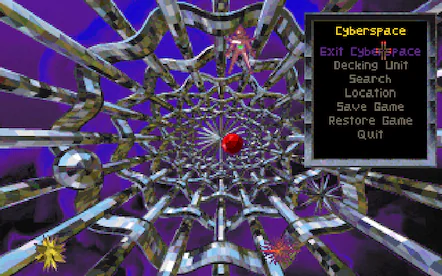
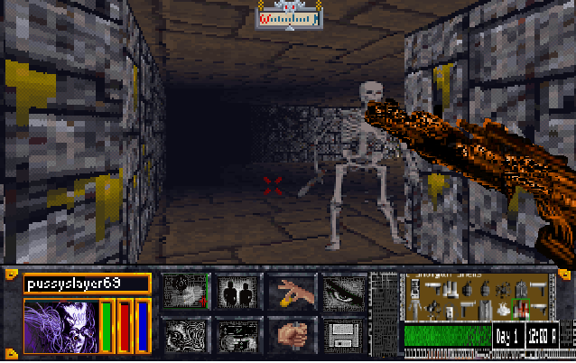

[Link to another page](https://on.soundcloud.com/T1xoapk9aFPLEQst6).







# Don't fight the other inmates, you just end up doing more time.

Silicon Crusts Over My Eyes, as I awake to another wholesome Trans-technical breakfast.
This time, the toast is too crisp.
A friend's burnt mind has crumbled to dust.
His feeble form rots at the deck.
His mind just plankton in the cyber sea, washed with the sediment of 1000 other dissolved integrities.
 
I ROM to see for a mere term of the “freedom to know.”
But do I rock the boat?
Mine spills over with the juice of revolutionary idea!
Every drop licked up by the data police.
And promptly disposed of while a record is made of my transgressions.
 
I atone to my sins at the great mega corporation alter.
It hears all and forgives all.
It demands only my soul as penance.
Orwell, Sterling, and Gibson - They washed us only in the water of electric knowledge.
But one has come that surrounds us with a sea.
Water, water everywhere, but not a drop to drink.
It is the new god.
Everywhere!
A nano deity that pervades the network of our souls.
A vengeful god, indeed.

## Header 2

> This is a blockquote following a header.
>
> When something is important enough, you do it even if the odds are not in your favor.

### Header 3

```js
// Javascript code with syntax highlighting.
var fun = function lang(l) {
  dateformat.i18n = require('./lang/' + l)
  return true;
}
```

```ruby
# Ruby code with syntax highlighting
GitHubPages::Dependencies.gems.each do |gem, version|
  s.add_dependency(gem, "= #{version}")
end
```

#### Header 4

*   This is an unordered list following a header.
*   This is an unordered list following a header.
*   This is an unordered list following a header.

##### Header 5

1.  This is an ordered list following a header.
2.  This is an ordered list following a header.
3.  This is an ordered list following a header.

###### Header 6

| head1        | head two          | three |
|:-------------|:------------------|:------|
| ok           | good swedish fish | nice  |
| out of stock | good and plenty   | nice  |
| ok           | good `oreos`      | hmm   |
| ok           | good `zoute` drop | yumm  |

### There's a horizontal rule below this.

* * *

### Here is an unordered list:

*   Item foo
*   Item bar
*   Item baz
*   Item zip

### And an ordered list:

1.  Item one
1.  Item two
1.  Item three
1.  Item four

### And a nested list:

- level 1 item
  - level 2 item
  - level 2 item
    - level 3 item
    - level 3 item
- level 1 item
  - level 2 item
  - level 2 item
  - level 2 item
- level 1 item
  - level 2 item
  - level 2 item
- level 1 item

### Definition lists can be used with HTML syntax.

<dl>
<dt>Name</dt>
<dd>Godzilla</dd>
<dt>Born</dt>
<dd>1952</dd>
<dt>Birthplace</dt>
<dd>Japan</dd>
<dt>Color</dt>
<dd>Green</dd>
</dl>

```
Long, single-line code blocks should not wrap. They should horizontally scroll if they are too long. This line should be long enough to demonstrate this.
```

```
The final element.
```
