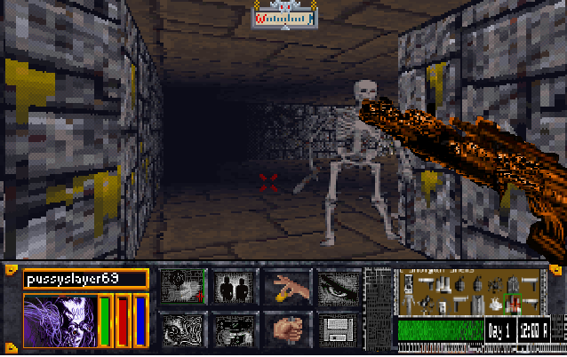

[Link to another page]().





# Don't fight the other inmates, you just end up doing more time.

Silicon Crusts Over My Eyes, as I awake to another wholesome Trans-technical breakfast.
This time, the toast is too crisp.
A friend's burnt mind has crumbled to dust.
His feeble form rots at the deck.
His mind just plankton in the cyber sea, washed with the sediment of 1000 other dissolved integrities.
 
I ROM to see for a mere term of the “freedom to know.”
But do I rock the boat?
Mine spills over with the juice of revolutionary idea!
Every drop licked up by the data police.
And promptly disposed of while a record is made of my transgressions.
 
I atone to my sins at the great mega corporation alter.
It hears all and forgives all.
It demands only my soul as penance.
Orwell, Sterling, and Gibson - They washed us only in the water of electric knowledge.
But one has come that surrounds us with a sea.
Water, water everywhere, but not a drop to drink.
It is the new god.
Everywhere!
A nano deity that pervades the network of our souls.
A vengeful god, indeed.

# Portfolio Project Documentation: Azure VM SIEM & SOC Analysis with Microsoft Sentinel

**Objective:** To create a foundational Security Information and Event Management (SIEM) environment using a free-tier Azure Virtual Machine (VM) and Microsoft Sentinel. This setup will collect security logs from the VM, integrate Threat Intelligence (TI) feeds, and implement detection rules to identify and alert on activities involving foreign or known suspicious IP addresses.

**Core Components:**

   1. Azure VM (Free Tier): The source of security logs (e.g., Windows Security Events, Linux Syslog).
   2. Azure Log Analytics Workspace: The underlying data repository where logs are stored and queried.
   3. Microsoft Sentinel: The cloud-native SIEM solution providing threat detection, analysis, intelligence, and hunting capabilities.
   4. Azure Monitor Agent (AMA) & Data Collection Rules (DCR): The mechanism to collect logs from the VM and send them to the Log Analytics Workspace.
   5. Threat Intelligence Connectors (Sentinel): Feeds that enrich log data with information about malicious IPs, domains, etc.
   6. Analytics Rules (Sentinel): Queries that run on a schedule to detect specific patterns indicative of threats.

**Disclaimer on "Free":**

    Azure Free Account: Provides credits for the first 30 days and makes certain services free for 12 months (e.g., 750 hours/month of a B1s Linux or Windows VM).
    Log Analytics Workspace: Has a free data ingestion tier (currently 5 GB per billing month).
    Microsoft Sentinel: Offers a free trial period (typically the first 31 days, check current Azure offers). During the trial, both Sentinel and Log Analytics ingestion might be free up to a certain limit (e.g., 10GB/day). After the trial, Sentinel has its own pricing based on ingested data in addition to the Log Analytics costs. Crucially: Ingesting VM logs (like Security Events or Syslog) into the Log Analytics Workspace will count towards your 5GB free limit even after the Sentinel trial ends. Exceeding this limit will incur costs.
    Conclusion: This environment can be run with minimal to no cost during initial trial periods and the first 12 months if log volume is kept strictly below the 5GB/month Log Analytics free tier. Be vigilant about monitoring data ingestion to avoid unexpected charges.

# Step-by-Step Implementation:

**Step 1: Create a Log Analytics Workspace**

    Log in to the Azure portal (https://portal.azure.com).
    Search for "Log Analytics workspaces" and click "Create".
    Select your Subscription and Resource Group (create a new one if needed, e.g., rg-sentinel-portfolio).
    Provide a unique Name (e.g., law-sentinel-portfolio).
    Choose a Region. Select a region where both Log Analytics and Sentinel are available, and consider proximity for latency if applicable.
    Review the pricing tier (the free tier will apply automatically up to the limit).
    Click "Review + Create", then "Create".

**Step 2: Enable Microsoft Sentinel**

    Once the Log Analytics Workspace is deployed, search for "Microsoft Sentinel" in the Azure portal.
    Click "Create Microsoft Sentinel".
    Select the Log Analytics Workspace you created in Step 1 (e.g., law-sentinel-portfolio) and click "Add".
    Wait for Sentinel to be enabled on the workspace. This may take a few minutes.

**Step 3: Create an Azure Virtual Machine (Free Tier)**

    In the Azure portal, search for "Virtual machines" and click "Create" -> "Azure virtual machine".
    Select your Subscription and Resource Group (use the same one, rg-sentinel-portfolio).
    Provide a Virtual machine name (e.g., vm-logsource-portfolio).
    Choose the same Region as your Log Analytics Workspace.
    Image:
        Windows: Select a Windows Server image (e.g., Windows Server 2019/2022 Datacenter). Windows Security Events are rich log sources.
        Linux: Select a Linux distribution (e.g., Ubuntu Server LTS). Linux auth.log or syslog provides login information.
    Size: Click "See all sizes" and filter for "B1s". Select the B1s size, which is typically eligible for the free tier (750 hours/month for 12 months).
    Create an Administrator account (username and strong password). Remember these credentials.
    Inbound port rules:
        For Windows: Allow RDP (port 3389).
        For Linux: Allow SSH (port 22).
        Security Note: For a portfolio piece, allowing these directly from the internet is acceptable for testing, but in production, you would restrict the Source IP addresses using the Network Security Group (NSG) or use Azure Bastion. Be aware of the security implications.
    Proceed through the "Disks", "Networking" (ensure it's creating a new VNet/Subnet/Public IP/NSG or using existing ones in your resource group), "Management", "Monitoring", and "Advanced" tabs. Default settings are generally okay for this basic setup, but ensure Monitoring (specifically Boot diagnostics) is enabled.
    Click "Review + Create", then "Create".

**Step 4: Connect the VM to Microsoft Sentinel**

    Navigate back to your Microsoft Sentinel instance.
    Under "Configuration", click on Data connectors.
    In the search bar, type:
        For Windows: "Windows Security Events"
            Select the "Windows Security Events via AMA" connector. Click "Open connector page".
            Click "+ Create data collection rule".
            Provide a Rule name (e.g., dcr-windows-security-events).
            Select your Subscription and Resource Group.
            On the "Resources" tab, expand your Resource Group (rg-sentinel-portfolio) and select the Windows VM you created (vm-logsource-portfolio). Click "Next".
            On the "Collect" tab, choose which events to collect. "Common" is a good starting point for security analysis (includes logon events 4624, 4625). You could select "Minimal" to reduce log volume further. Click "Next".
            Click "Review + Create", then "Create".
        For Linux: "Syslog"
            Select the "Syslog via AMA" connector. Click "Open connector page".
            Click "+ Create data collection rule".
            Provide a Rule name (e.g., dcr-linux-syslog).
            Select your Subscription and Resource Group.
            On the "Resources" tab, select your Linux VM (vm-logsource-portfolio). Click "Next".
            On the "Collect" tab, select the facilities and log levels. Ensure auth and authpriv are collected at INFO or NOTICE level (or higher) to capture login attempts. Click "Next".
            Click "Review + Create", then "Create".
    Agent Installation: The Data Collection Rule deployment will automatically try to install the Azure Monitor Agent (AMA) on the selected VM if it's not already there. Monitor the deployment process. It might take 5-15 minutes for the agent to install and start sending logs.
    Verify Connection: On the connector page in Sentinel, you should eventually see the data graph start showing activity after logs begin flowing. You can also query the data directly in Logs (see Step 8).

**Step 5: Configure Threat Intelligence Connectors in Sentinel**

    In Microsoft Sentinel, navigate to Data connectors.
    Search for "Threat Intelligence".
    Enable these key connectors (they are typically free):
        Microsoft Defender Threat Intelligence (Preview): Click on it, "Open connector page", and click "Connect". This provides Microsoft's curated TI.
        Threat Intelligence Platforms: Click on it, "Open connector page", and click "Connect". This enables ingestion from TAXII feeds or APIs if you configure them later (optional for this basic setup).
        Threat Intelligence - TAXII: If you have access to a specific free TAXII feed (like Abuse.ch or AlienVault OTX), you can configure it here, but it's not strictly necessary for the basic goal using Microsoft's TI.
    Once connected, TI data will start populating the ThreatIntelligenceIndicator table in your Log Analytics Workspace, which Sentinel uses for correlation.

**Step 6: Create Analytics Rules for Suspicious IPs**

    In Microsoft Sentinel, navigate to Analytics under "Configuration".

    Click "+ Create" -> "Scheduled query rule".

    Rule 1: Login from IP matching Threat Intelligence Feed
        Name: [Portfolio] Sign-in from TI-flagged IP Address
        Tactics & Techniques: Map to relevant MITRE ATT&amp;CK tactics (e.g., Initial Access, Credential Access).
        Severity: Medium or High.
        Rule Logic (Kusto Query Language - KQL):
        Code snippet

// For Windows Logon Events (EventID 4624 is successful logon)
let lookback = 1h; // How far back to check logs
SecurityEvent
| where TimeGenerated > ago(lookback)
| where EventID == 4624 // Successful Logon
| where IpAddress != "-" and IpAddress != "127.0.0.1" and IpAddress != "::1" // Exclude non-routable/local IPs
| lookup kind=inner ( ThreatIntelligenceIndicator
    | where TimeGenerated > ago(30d) // Use recent TI data
    | summarize LatestIndicatorTime = arg_max(TimeGenerated, *) by NetworkIP
    | where Active == true and ExpirationDateTime > now() // Ensure TI is active
    | extend TI_IP = NetworkIP
  )
  on $left.IpAddress == $right.TI_IP
| extend IPCustomEntity = IpAddress, AccountCustomEntity = Account
| project TimeGenerated, Computer, Account, AccountType, LogonTypeName, IpAddress, Activity, Description, ConfidenceScore, ThreatType, TI_IP, LatestIndicatorTime

    (Note: If using Linux, you'd query the Syslog table instead, parsing the IP address and joining similarly. Example below - adjust field names based on your Linux logs): <!-- end list -->

# Code snippet

    // For Linux Syslog (adjust based on actual log format)
    let lookback = 1h;
    Syslog
    | where TimeGenerated > ago(lookback)
    | where SyslogMessage has "Accepted password for" or SyslogMessage has "session opened for user" // Adjust keywords for your distro/logs
    | extend SrcIpAddress = extract(@"from\s+(\d{1,3}\.\d{1,3}\.\d{1,3}\.\d{1,3})", 1, SyslogMessage) // Example IP extraction
    | where isnotempty(SrcIpAddress) and SrcIpAddress != "127.0.0.1"
    | lookup kind=inner ( ThreatIntelligenceIndicator
        | where TimeGenerated > ago(30d)
        | summarize LatestIndicatorTime = arg_max(TimeGenerated, *) by NetworkIP
        | where Active == true and ExpirationDateTime > now()
        | extend TI_IP = NetworkIP
      )
      on $left.SrcIpAddress == $right.TI_IP
    | extend IPCustomEntity = SrcIpAddress, AccountCustomEntity = extract(@"user\s+([^\s]+)", 1, SyslogMessage) // Example user extraction
    | project TimeGenerated, Computer, SyslogMessage, SrcIpAddress, TI_IP, Description, ConfidenceScore, ThreatType, LatestIndicatorTime

    Entity Mapping: Map IpAddress (or SrcIpAddress) to IP Address entity and Account (or extracted user) to Account entity.
    Query Scheduling: Run every 5-15 minutes, lookup data from the last 1 hour (adjust as needed).
    Alert Threshold: Generate alert when number of results is greater than 0.
    Incident Settings: Enable "Group related alerts into incidents".
    Automated Response: (Optional/Advanced) You could trigger Logic Apps later.
    Review and Create.

**Rule 2: Login from Unexpected Foreign Country**

    Name: [Portfolio] Sign-in from Unexpected Country
    Tactics & Techniques: Initial Access.
    Severity: Medium.
    Rule Logic (KQL):
    Code snippet

        // For Windows Logon Events (EventID 4624)
        let lookback = 1h;
        let known_good_countries = dynamic(["United States", "Canada"]); // Add countries you expect logins from
        SecurityEvent
        | where TimeGenerated > ago(lookback)
        | where EventID == 4624
        | where IpAddress != "-" and IpAddress != "127.0.0.1" and IpAddress != "::1"
        | evaluate PIIProtectionLevel = none // Needed for geo_location_city_ipaddress()
        | extend GeoData = geo_location_lookup_ipv4(IpAddress)
        | extend Country = tostring(GeoData.countryOrRegion)
        | where isnotempty(Country) and Country !in (known_good_countries)
        | extend IPCustomEntity = IpAddress, AccountCustomEntity = Account
        | project TimeGenerated, Computer, Account, AccountType, LogonTypeName, IpAddress, Country, Activity // Activity is usually just "Security" for SecurityEvent

            (Adapt for Linux Syslog similar to Rule 1, extracting IP and using geo_location_lookup_ipv4)
        Entity Mapping: Map IpAddress to IP Address, Account to Account.
        Query Scheduling: Run every 1 hour, lookup data from the last 1 hour (or longer if needed).
        Alert Threshold: Greater than 0.
        Incident Settings: Enabled.
        Review and Create.

**Step 7: Simulate Traffic (Carefully!)**

    Connect to your VM: Use RDP (Windows) or SSH (Linux) from your normal IP address first to generate some baseline logs.
    Simulate "Foreign" Login: If you have access to a VPN service, connect through a server in a country not listed in your known_good_countries list (Rule 2) and then try to log into your Azure VM via RDP/SSH. A successful login should trigger Rule 2.
    Simulate "Suspicious" Login (Use Caution): Find a known, publicly listed suspicious IP address (e.g., from a public TOR exit node list or a feed like Abuse.ch). Do not use highly malicious IPs you are unsure about. If using a VPN or proxy service allows you to route traffic through such an IP, attempt an RDP/SSH connection (it will likely fail, but the attempt might be logged depending on firewall/NSG settings, or a successful login will trigger Rule 1). This carries risk; ensure you understand what you are doing and have controls in place (like the NSG). Alternatively, you can manually add a test IP address to the ThreatIntelligenceIndicator table via Log Analytics query or API for safe testing.

**Step 8: Monitor and Analyze in Sentinel**

    Incidents: Go to the Incidents blade in Sentinel. As your analytics rules detect matching activity, incidents will be generated here. Click on an incident to investigate.
        See the Alerts involved.
        View Entities (IPs, Accounts).
        Use the Investigation Graph to visualize relationships.
        Check the raw events that triggered the alert.
    Logs: Go to the Logs blade. This is where you can run ad-hoc KQL queries.
        Check if VM logs are arriving: SecurityEvent | count or Syslog | count.
        Check TI data: ThreatIntelligenceIndicator | count.
        Run your analytics rule queries manually to test them.
        Investigate specific IPs: SecurityEvent | where IpAddress == "X.X.X.X" or ThreatIntelligenceIndicator | where NetworkIP == "X.X.X.X".
    Threat Intelligence: Explore the Threat Intelligence blade to view ingested indicators, search for specific IPs/domains, and manage TI connectors.
    Workbooks: Use pre-built workbooks (like "Threat Intelligence") or create your own to visualize data (e.g., map of login locations, list of TI hits).

# How Does It All Work?

**1. How Data Flows from the VM to Sentinel**

The flow of log data from your Azure VM into Microsoft Sentinel involves several key components working together:

    Log Generation (on VM): The operating system on your Azure VM continuously generates logs about its activity.
        Windows: Creates Security Event Logs (e.g., Event ID 4624 for successful login, 4625 for failed login, 4688 for process creation).
        Linux: Creates logs typically managed by syslog or rsyslog (e.g., messages in /var/log/auth.log or /var/log/secure for logins, /var/log/syslog for general system messages).
    Azure Monitor Agent (AMA) (on VM): This agent is installed on your VM. Think of it as the data collector living inside the machine. It's responsible for reading the specific logs you tell it to.
    Data Collection Rule (DCR) (in Azure): This is the configuration that instructs the AMA. When you set up the "Windows Security Events via AMA" or "Syslog via AMA" data connector in Sentinel, you create a DCR. This rule specifies:
        Which VM(s) the rule applies to.
        What specific logs to collect (e.g., only Security Events with ID 4624 and 4625, or only auth and authpriv syslog facilities).
        Where to send the collected data.
    Log Analytics Workspace (in Azure): The DCR directs the AMA to send the collected log data securely to your designated Log Analytics Workspace. This workspace acts as a large, cloud-based database optimized for storing and querying vast amounts of log and performance data.
    Microsoft Sentinel (in Azure): Sentinel is enabled on top of your Log Analytics Workspace. It doesn't store data separately in this context; rather, it leverages the data already present in the connected Log Analytics Workspace. Sentinel uses this data for:
        Running scheduled Analytics Rules (queries).
        Displaying data in Workbooks (visualizations).
        Allowing interactive hunting queries (via the Logs blade).
        Correlating logs with its built-in Threat Intelligence.
        Managing Incidents generated from alerts.

In short: OS generates logs -> AMA reads specific logs (instructed by DCR) -> AMA sends logs to Log Analytics Workspace -> Sentinel uses data within Log Analytics Workspace for analysis and alerting.

**2. The Purpose of Threat Intelligence Feeds**

Threat Intelligence (TI) feeds are crucial in cybersecurity because they provide essential context about potential threats observed in the wider digital world. In the context of Sentinel:

    What they are: Curated lists of indicators associated with malicious activity. These indicators include things like:
        IP addresses (used by botnets, command-and-control servers, TOR exit nodes, scanners)
        Domain names (used for phishing, malware distribution)
        File hashes (known malware)
        URLs (malicious links)
    Why they are used: Raw logs from your VM only tell you what happened internally (e.g., "User 'admin' logged in from IP 1.2.3.4"). They don't tell you if IP 1.2.3.4 is inherently dangerous. TI feeds bridge this gap.
    How Sentinel uses them:
        Ingestion: Sentinel connects to TI feeds (like Microsoft's own feed via the "Microsoft Defender Threat Intelligence" connector) and stores this indicator data in the ThreatIntelligenceIndicator table within your Log Analytics Workspace.
        Correlation: Sentinel's Analytics Rules (like the first one you created) can automatically compare data from your logs (e.g., the IpAddress field in SecurityEvent) against the list of known bad indicators in the ThreatIntelligenceIndicator table.
        Enrichment & Prioritization: A match instantly elevates the importance of that log event. A simple login becomes a "Login from a known malicious IP address," which is a much higher-priority alert requiring investigation. It turns potentially benign data points into actionable security intelligence.

In essence: TI feeds allow Sentinel to recognize when an activity within your environment involves an entity (like an IP address) that is already known to be associated with malicious actors or infrastructure globally.

**3. The Logic Behind Your Custom Analytics Rules (KQL Explanation)**

Let's break down the Kusto Query Language (KQL) for the two rules:

Rule 1: Login from TI-flagged IP Address
Code snippet

// For Windows Logon Events (EventID 4624 is successful logon)
let lookback = 1h; // 1. Define a variable 'lookback' to check logs from the last 1 hour.
SecurityEvent // 2. Start with the table containing Windows Security Event logs.
| where TimeGenerated > ago(lookback) // 3. Filter events to only include those within the 'lookback' period.
| where EventID == 4624 // 4. Filter further for successful logon events only.
| where IpAddress != "-" and IpAddress != "127.0.0.1" and IpAddress != "::1" // 5. Ignore logins with invalid or local loopback IPs.
| lookup kind=inner ( // 6. Perform a lookup (like a JOIN in SQL) to correlate with TI data. 'kind=inner' means we only keep logins if a matching TI record is found.
    ThreatIntelligenceIndicator // 7. This is the sub-query, targeting the TI table.
    | where TimeGenerated > ago(30d) // 8. Use TI indicators seen in the last 30 days (adjust as needed).
    | summarize LatestIndicatorTime = arg_max(TimeGenerated, *) by NetworkIP // 9. If an IP appears multiple times in TI, only keep the most recent record for that IP.
    | where Active == true and ExpirationDateTime > now() // 10. Ensure the TI indicator is currently marked as active and hasn't expired.
    | extend TI_IP = NetworkIP // 11. Rename NetworkIP to TI_IP for clarity in the final result.
  )
  on $left.IpAddress == $right.TI_IP // 12. This is the JOIN condition: match the 'IpAddress' from the SecurityEvent ($left) with the 'TI_IP' from the ThreatIntelligenceIndicator sub-query ($right).
| extend IPCustomEntity = IpAddress, AccountCustomEntity = Account // 13. Map the IpAddress and Account fields to Sentinel's recognized 'Entity' types for easier investigation later.
| project TimeGenerated, Computer, Account, AccountType, LogonTypeName, IpAddress, Activity, Description, ConfidenceScore, ThreatType, TI_IP, LatestIndicatorTime // 14. Select the specific columns you want to see in the alert details.

Logic Summary: This rule looks for recent successful logins from external IPs on your Windows VM. It then checks if the source IP address of any of these logins matches an active, non-expired indicator in Sentinel's Threat Intelligence database. If a match is found, it generates an alert containing details from both the login event and the TI record.

Rule 2: Login from Unexpected Foreign Country
Code snippet

// For Windows Logon Events (EventID 4624)
let lookback = 1h; // 1. Define the time window for checking logs (last 1 hour).
let known_good_countries = dynamic(["United States", "Canada"]); // 2. Define an array of countries considered 'normal' or 'expected' for logins. **Adjust this list based on your location (Roseville, CA means "United States" is likely primary)**.
SecurityEvent // 3. Start with Windows Security Event logs.
| where TimeGenerated > ago(lookback) // 4. Filter for events within the lookback period.
| where EventID == 4624 // 5. Filter for successful logon events.
| where IpAddress != "-" and IpAddress != "127.0.0.1" and IpAddress != "::1" // 6. Ignore invalid or local IPs.
| evaluate PIIProtectionLevel=none // 7. This statement might be needed to explicitly allow the geo-lookup function depending on workspace data handling settings.
| extend GeoData = geo_location_lookup_ipv4(IpAddress) // 8. Use a built-in function to enrich the event with GeoIP information based on the 'IpAddress'. Creates a new column 'GeoData' containing location details.
| extend Country = tostring(GeoData.countryOrRegion) // 9. Extract just the country name from the 'GeoData' into a new 'Country' column.
| where isnotempty(Country) and Country !in (known_good_countries) // 10. THE CORE LOGIC: Keep only those events where a Country was successfully identified AND that Country is NOT in your predefined 'known_good_countries' list.
| extend IPCustomEntity = IpAddress, AccountCustomEntity = Account // 11. Map IP and Account to Sentinel Entities.
| project TimeGenerated, Computer, Account, AccountType, LogonTypeName, IpAddress, Country, Activity // 12. Select the columns for the alert, including the identified 'Country'.

Logic Summary: This rule looks for recent successful logins from external IPs. It uses Azure's built-in capabilities to determine the geographical location (country) of the source IP address. If the determined country is not on your pre-approved list (known_good_countries), it generates an alert, flagging it as a potentially suspicious login from an unexpected location.

**4. How You Would Investigate an Incident Generated by These Rules**

When an incident pops up in the Sentinel Incidents queue triggered by one of these rules, a structured investigation process is key:

    Acknowledge & Triage: Assign the incident to yourself and set its status to "Active". Note the severity (Medium/High) and the rule that triggered it.
    Understand the Basics (Incident Overview):
        What rule fired? Tells you why this is suspicious (TI match or unexpected Geo).
        What time did it happen? Establishes the timeframe.
        What are the key Entities? Instantly see the involved IP Address and Account. These are your primary pivot points.
    Examine the Entities:
        Click on the IP Address entity. Sentinel might show related alerts, a timeline of its activity across logs, and TI details if available. Is this IP associated with other suspicious incidents?
        Click on the Account entity. Has this account logged in successfully before? From where? Are there other suspicious activities associated with this account recently (e.g., failed logins, unusual process executions)?
    Analyze the Triggering Event(s):
        Go to the Alerts or Overview tab within the incident and click to view the raw log events that matched the rule's KQL query. Verify the details: Was it definitely Event ID 4624? Does the timestamp match? Is the IP address correct?
    Broaden the Investigation using Logs: Go to the Logs blade (Sentinel will often pre-fill a query related to the incident). Ask more questions using KQL:
        IP Activity:
            search in (SecurityEvent, Syslog) "SUSPICIOUS_IP_ADDRESS" | where TimeGenerated between (datetime(ALERT_TIME) - 1h .. datetime(ALERT_TIME) + 1h) - What else did this IP do around the time of the alert? Any failed logins (EventID 4625)? Any other activity?
            If Rule 1 fired: ThreatIntelligenceIndicator | where NetworkIP == "SUSPICIOUS_IP_ADDRESS" - Get more context from the TI feed (threat type, description).
        Account Activity:
            search in (SecurityEvent, Syslog) "AFFECTED_ACCOUNT_NAME" | where TimeGenerated between (datetime(ALERT_TIME) - 1h .. datetime(ALERT_TIME) + 1h) - What else did this account do around the time of the alert? Any password changes? Processes created?
            SecurityEvent | where EventID == 4624 and Account == "AFFECTED_ACCOUNT_NAME" | summarize count() by IpAddress, Country = geo_location_lookup_ipv4(IpAddress).countryOrRegion | order by count_ desc - Where does this account normally log in from? Is this alert's source IP/Country unusual for this specific account?
        VM Activity:
            SecurityEvent | where Computer == "VM_NAME" and TimeGenerated between (...) | summarize count() by Activity - Was there any other unusual activity on the VM around the same time (e.g., process creation - EventID 4688, service installation)?
    Correlate and Conclude: Based on the evidence gathered:
        Is this a True Positive (actual suspicious activity)?
            If TI match: The IP is confirmed malicious. Likely credential compromise or attack attempt.
            If Geo match: Is it plausible the legitimate user was travelling? Or is it likely an unauthorized login from an unexpected location?
        Is this a False Positive (legitimate activity incorrectly flagged)?
            If TI match: Could be an outdated TI entry or an IP shared by legitimate services (rare for high-confidence TI).
            If Geo match: Maybe the user was travelling, using a corporate VPN that exits elsewhere, or the GeoIP lookup was inaccurate.
    Document and Respond (Simulated for Portfolio):
        Add comments to the incident detailing your findings.
        Close the incident with the correct classification (True Positive/False Positive).
        Describe the next steps you would take in a real scenario:
            Containment: Block the IP address in the Network Security Group (NSG) or firewall; disable the compromised user account.
            Eradication: Remove any persistence mechanisms if the VM was compromised.
            Recovery: Restore the VM from backup if necessary; reset passwords.
            Lessons Learned: Adjust firewall rules, improve password policies, tune the Sentinel Analytics Rule (e.g., add the country to the known_good_countries list if it was a false positive due to travel).

**5. The Limitations**

This setup, while valuable for learning and portfolio demonstration, has significant limitations compared to a production SOC environment:

    Limited Scope/Visibility: You are only monitoring logs from a single VM. A real attack often involves multiple systems, network devices, cloud services (like Azure AD for identity), and applications. This setup provides a very narrow view and might miss large parts of an attack chain.
    Basic Log Sources: Relying primarily on standard Windows Security Events or Linux Syslog. More advanced endpoint detection requires richer telemetry, often provided by Endpoint Detection and Response (EDR) solutions (like Microsoft Defender for Endpoint) or tools like Sysmon, which log more granular detail (process command lines, network connections per process, registry changes, etc.).
    Free Tier Constraints:
        Log Volume: The 5GB/month free Log Analytics ingestion is extremely limited and easily surpassed by even moderately busy systems, leading to unexpected costs or data gaps if ingestion stops.
        Cost: Sentinel itself (and the underlying Log Analytics) incurs costs based on data volume after the free trial/allowance, which can become significant in a real environment. The free VM offer is also time-limited (12 months).
    Simplistic Detection Rules: The two rules are basic examples. Production environments use dozens or hundreds of rules, including complex correlation, behavioral analytics (UEBA - User and Entity Behavior Analytics) to detect anomalies, and Machine Learning models provided by Sentinel.
    Threat Intelligence Depth: Relying mostly on Microsoft's TI feed is good, but mature SOCs often integrate multiple commercial and open-source TI feeds for broader coverage.
    GeoIP Inaccuracy: GeoIP lookups are not foolproof. They can be inaccurate, and attackers can easily use VPNs or compromised machines in other countries to mask their true origin, potentially bypassing the Geo-based rule or making attribution difficult.
    Lack of Automation (SOAR): Investigation is manual. A production environment would use Security Orchestration, Automation, and Response (SOAR) playbooks (like Azure Logic Apps triggered by Sentinel) to automate common responses like blocking an IP, disabling a user, or enriching alerts with more data.
    Security Posture: Exposing RDP/SSH directly to the internet for the VM, even for testing, is inherently risky. Secure alternatives like Azure Bastion (jump host service) or Just-In-Time (JIT) VM access should be used in practice.
    No Network-Level Visibility: You are missing network traffic analysis (e.g., from NSG Flow Logs, Azure Firewall logs, or dedicated Network Detection and Response tools) which provides critical context about connections attempts, data flows, and lateral movement.


```js
// Javascript code with syntax highlighting.
var fun = function lang(l) {
  dateformat.i18n = require('./lang/' + l)
  return true;
}
```

```ruby
# Ruby code with syntax highlighting
GitHubPages::Dependencies.gems.each do |gem, version|
  s.add_dependency(gem, "= #{version}")
end
```

```
Long, single-line code blocks should not wrap. They should horizontally scroll if they are too long. This line should be long enough to demonstrate this.
```

```
The final element.
```
